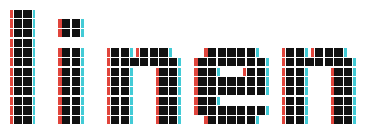
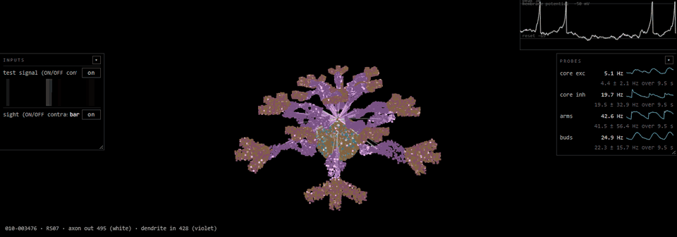
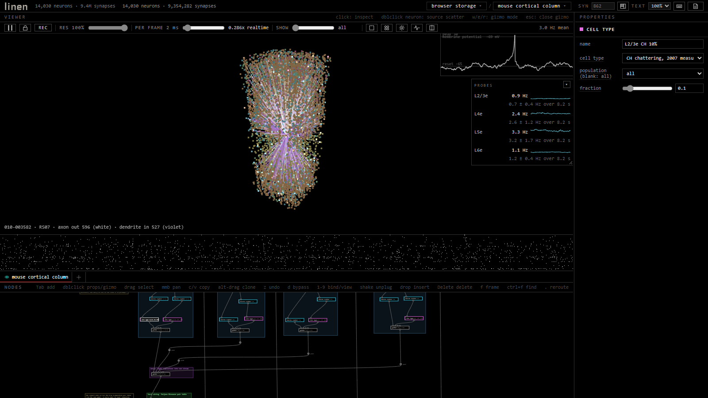
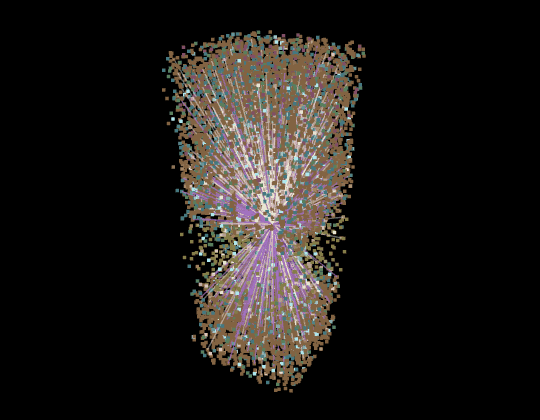

<p align="center">
  <picture>
    <source media="(prefers-color-scheme: dark)" srcset="brand/linen-dark.svg">
    
  </picture>
</p>

<p align="center">A sandbox for 3D spiking neural networks.</p>

<p align="center"><b><a href="https://linen.build">Try it in your browser</a></b> · <a href="#quick-start">Run it locally</a> · <a href="https://linen.build/docs">Docs</a></p>

<p align="center"></p>

Each neuron has a position, typed connections (axon out, dendrite in) and biophysical properties that drive its spiking.

A node graph builds the network; it runs live in the browser at tens of thousands of neurons, and at hundreds of millions of synapses on a GPU.

Three engines (a browser reference, WebGPU, CUDA) run one contract.

All spatial units are **micrometers** (velocities in µm/ms; 100 µm/ms = 0.1 m/s, the unmyelinated intracortical range). Delays are distance / velocity in ms.

Built on published models (sources below) for learning and exploring; not a scientific instrument. The docs' limitations page lists what the model leaves out and what each choice costs.

## Quick start

No build step and no runtime dependencies. Three.js is vendored in
`vendor/`. Clone the repository and run the dev server from its root:

```
git clone https://github.com/sethgjosephson/linen
cd linen

# macOS / Linux
python3 serve.py 8173

# Windows
py serve.py 8173
```

Open http://localhost:8173.

| | |
|---|---|
| `serve.py` | Serves files uncached; owns the project folder (`./project`, or `--project PATH`) and its file API; starts the CUDA engine host for training |
| Another static server | Runs the graph and simulation; scenes and brains fall back to browser storage, as the top bar shows |

## Interface

<p align="center"></p>

| Panel | |
|---|---|
| **Viewer** | 3D view: orbit, pan, zoom; click a neuron to select it; spike raster below, oscilloscope for the selected neuron |
| **Nodes** | The graph, with open scenes as tabs; the viewer keeps its scene until a viewer key is pressed in another tab |
| **Properties** | The node opened by double-click; geometry and wiring edits rewire, stimulus and checkpoint edits re-tune in place |
| **Top bar** | Counts, status, `project / scene` (both menus), KEYS, DOCS, and the pane layout button (four arrangements, sizes kept) |
| **Viewer bar** | Pause, weight lock, resolution, per frame with realtime factor, potential filter, mean rate |

| In the graph | |
|---|---|
| Tab | Add a node; type to filter tools and scenarios, Enter adds the top match |
| Wires | Drag from either end; grab a wired input to re-drag it; release on empty space for an auto-connected add menu |
| Drop on a wire | Inserts a node inline; several insert as a chain |
| Shake while dragging | Unplugs a node and heals the wire |
| Delete, bypass key | Remove and splice; toggle the selection |
| Escape, F, wheel, middle-drag | Cancel, frame all, zoom, pan |
| Left-drag, Shift | Selection box, add to it |
| Double-click | Properties; a viewer manipulator for shapes and unmasked stimuli |
| Right-click a label | Its documentation |

| Resolution slider | |
|---|---|
| At 40% | Every scatter places 40% of its count; weights × 1/√res; a per-neuron DC current restores the mean input (van Albada) |
| DC target | The rate measured at 100%, through the charge per spike under the checkpoint's synapse convention |
| Preserved | Regime, rates and spectra; not correlations, and training requires 100% |
| Unchanged | Authored parameters; a resolution visited before restores from the cache |
| Connect node | `density % of real`, `kscale`, target rates (0 = auto) |
| Wiring | A pool of workers, one presynaptic slice each, with a progress bar |

## The node graph

Data flows top to bottom: geometry → points → network → checkpoint. Side inputs (masks, signals) are diamond ports with dashed wires.

| Node | In → Out | Purpose |
|---|---|---|
| `sphere`, `box`, `ellipsoid`, `cylinder`, `torus`, `spline` | → geometry | Volumes; the spline is a tube through four control points |
| `mesh` | → geometry | An OBJ or glTF (.glb) object, filled by ray parity |
| `noise field` | → geometry | A seeded density field: blobs, patches, stripes |
| `neuron scatter` | geometry → points | Neurons with stable identity, soma spacing, optional minicolumns |
| `points file` | → points | Positions from CSV or PLY, with an optional id column |
| `receptor`, `cell type`, `population` | points → points | Synaptic channels; a type row for a population; one tag out of a stream |
| `gather` | points ×4 → points | Concatenates streams |
| `move`, `noise warp`, `twist`, `gauss blur` | points → points | Transform, displace, twist, jitter |
| `repeat` | points → points | Stepped copies, each a population |
| `cull`, `gradient`, `operations` | points (+ mask) → points | Remove by a mask; a density ramp; a formula per point |
| `project`, `plasticity` | points → points | A topographic tract; a named rule for a pathway |
| `connections file` | points → points | Explicit synapses (pre id, post id, count, transmitter) |
| `feedback inhibition` | points → points | A lumped inhibitory pool per population |
| `connect` | points → network | Kernel, radius, weights, velocity, pair table, cluster boost |
| `stimulus`, `input` | network (+ mask, signal) → network | Constant, pulse, ramp or noise current; a signal onto a population |
| `curriculum`, `test signal`, `live`, `footage` | → signal | Lessons in one sense; a bar sweep; microphone or webcam; an image folder |
| `probe`, `analysis`, `chart` | network → network | Rate, grid or sound; run measures; figures (PNG, SVG) with their data |
| `checkpoint` | network → sim | Engine, synapse model, refractory period, floor, plasticity, sweep, training |
| `pin`, `note` | | Reroute; annotation |

The same graph and seeds compute the same network; the same network and seed simulate alike on every engine up to summation order.

A project's `nodes/*.js` files are node modules: the default export receives `registerNode`, and their nodes join the Tab menu, panel and reference. The project menu lists them and adds one from a URL; a scene without its modules is refused. See `examples/nodes/jitter.js`, EXTENDING.md and the docs page "custom nodes and engines".

## The science inside

| The model | |
|---|---|
| Cells | Izhikevich 2007 point neurons on the measured chapter 8 rows (RS, IB, CH, FS, LTS, TC, RZ) or the seven 2003 presets |
| Step | One millisecond |
| Connectivity | Gaussian distance kernels and population pair tables, drawn at wiring time; lognormal weights |
| Synapses | Current kicks, exponentials or conductances |
| Plasticity | Pair and triplet STDP; heterosynaptic, transmitter, inhibitory, scaling, short-term and consolidation terms; each from its published source |
| Export | CSV tables, Neo spike trains, or a Brian 2 case reproducing the reference engine spike for spike |
| Validation | A battery holds the scenes to published rates |

| | |
|---|---|
| Membrane | Izhikevich (2007): C dv/dt = k (v − vr)(v − vt) − u + I, per type in pF, mV and pA (MODEL.md section 1) |
| Cell types | The seven 2003 presets (RS, IB, CH, FS, LTS, TC, RZ) as rows, the defaults; chapter 8, fly and graded rows beside them |
| Refractory, floor | 2 ms absolute; -90 mV, the potassium reversal |
| Dale's law | A neuron's type signs all its outgoing synapses |
| Feedback inhibition | Each pool spike delivers gain × 1000 / N to every pool cell 1 ms later (fly APL, Lin et al. 2014; basket cells, Andersen, Eccles and Løyning 1963) |
| Connectivity | A Gaussian kernel within a max radius (NEST spatial networks); existence and weight hash the two identities and the seed |
| Delays | Distance / velocity, 1-16 ms, clamps counted |
| Summation | One input current per step, E and I in one pool; subthreshold charge integrates in the membrane |
| Oscilloscope | EPSPs ramp toward threshold (-55 mV for RS); spikes cut off at +30 mV (classic types) |
| Synapses | **kick** or **exp decay**; `psc` *peak* (NEST `iaf_psc_exp`, Brian; charge w·tau) or *charge* (jump × (1 − e^(−1/tau)), charge w) |
| Regimes | 80/20 E/I after Brunel (2000): strong inhibition asynchronous irregular, weak synchronized |
| STDP | Song, Miller and Abbott (2000) traces; Bi and Poo 1998 windows, 16.8 and 33.7 ms (20 and 20 is Song's); soft bounds |
| Other rules | Vogels et al. (2011); Zenke, Agnes and Gerstner (2015) triplet, heterosynaptic, transmitter, consolidation; homeostatic scaling; per pathway |
| Short-term | Tsodyks-Markram, release before the facilitation step as published (rested release U); `stpOrder` 1 facilitates first (U(2 − U)); optionally scaled to w |
| Downscaling | van Albada, Helias & Diesmann (2015): weights by 1/√K, a DC from realized in-degrees; correlations not preserved |
| Downscaling check | 10× down: 7.2 Hz against 6.8 Hz full scale (1.3 Hz uncompensated), 1% of the synapses |

## Engines

| | |
|---|---|
| `src/simworker.js` | The CPU reference; defines correct behavior |
| `src/gpuworker.js` | WebGPU; `auto` picks it once a tick's arithmetic covers the round trip |
| `cuda/engine.cu` | Native child of `host/host.mjs` for training runs; Node and an NVIDIA card; rebuild with `nvcc -O3 -arch=sm_89 -o cuda/engine.exe cuda/engine.cu` |
| Contract | ENGINE.md; gated by the battery and `cuda/parity.mjs`; shared initial state and noise hash of (neuron, time, seed) |
| Custom | A WebSocket server answering `hello` and taking `init`, `tune`, `tick` (`src/frame.js`); `remote` on the checkpoint or `--engine remote --host ws://host:port` |
| Missing term | Not sent; the checkpoint grays it; the engine settings node passes a `custom` block |
| Tools | `tools/engine_template.py` (leaky integrate-and-fire, Python); `node tools/enginecheck.mjs ws://host:port`; ENGINE.md section 15 |

## Scenarios

<p align="center"></p>

Tab menu scenes are at mouse density with unitary weights, in µm. Experiment scenes (`src/experiments.js`) load by name, `?scenario=the weave`, or from the trainer. Each names its populations and carries probes and a chart.

| Tab menu | |
|---|---|
| **guided tour** | Default: a thin sheet, about 14,000 cells, waves from chattering cells and a pulsed source; fronts collide |
| **traveling waves** | The sheet at 1.2 mm: 39,000 cells, 27 M synapses; fronts in the 1-10 cm/s slice band |
| **mouse cortical column** | 400 µm × 1.2 mm, four layers at Potjans & Diesmann (2014) proportions; IB, CH, FS/LTS; L4 pulse |
| **visual pathway** | Retina, optic tract with lens inversion, relay in a reticular shell, cortex; retinotopy kept |
| **thalamocortical loop** | TC sphere in an RZ torus, an axon-tract cylinder to cortex; pulsed thalamic drive |
| **CA3 pattern completion** | A spline-tube band (15% IB); a cue recruits it in about 100 ms: 0.4 Hz baseline, 38 Hz cued end, 24 Hz far end |
| **balanced random net** | Brunel (2000) 4:1 E/I sphere; asynchronous irregular at a few Hz |
| **sound localization** | Delay lines and coincidence detectors (Jeffress 1948) |
| **virtual patch rig** | One cell per classic type on a current ramp |
| **seizure and control** | Inhibition silenced two seconds: runaway, then recovery; a mechanism, not a clinic |
| **gamma from inhibition** | Fast spiking cells pace 34 Hz (Whittington et al. 2000) |
| **working memory** | Facilitating synapses hold a cue (Mongillo, Barak and Tsodyks 2008) |
| **polychrony** | Firing order picks the reader (Izhikevich 2006) |
| **every node** | Every node kind needing no file or device; 43,000 cells, 12 M synapses |

| Experiment scenes | |
|---|---|
| **learning lab** | Retina and cochlea onto one patch; every fourth presentation drops a modality; in-degree held as it scales |
| **alphabet school 2** | The training scenario: visual, association and auditory territories at mouse density; gated plasticity |
| **binding bench** | Two senses, two areas, one association area; a replicate sweep, paired against scrambled |
| **the weave** | Two codes in one tissue; plastic recurrence, triplet and short-term terms, blocked curriculum (Pokorny et al. 2019) |

| Out of the app | |
|---|---|
| Chart node | Any plot as PNG, SVG or CSV; a raster as spike trains Neo reads |
| Checkpoint | The network as two CSV tables, or a Brian 2 case `tools/brian_ref.py` runs spike for spike (`tools/exportcheck.mjs`) |
| REC | Rates per probed population per 20 ms, every edit and pause, weights before and after; JSON and CSV under recordings |
| Scene link | The deflated scene after the hash, never uploaded; every seed and the resolution |
| Layout | A hand arrangement saved as the scenario's default (`src/layouts/<slug>.json`); settings stay in code |

## Running without the browser

`tools/linen.mjs` runs a scene from a shell on the reference or CUDA engine. An input node fed by a test signal is driven on simulated time; one fed by a curriculum, a device or footage is not, and `run.json` records it.

```
node tools/linen.mjs run "balanced random net" --seconds 2 --out runs/brn
```

| | |
|---|---|
| Writes | `run.json`, `rates.csv`, `release.csv` (graded populations, percent release), `spikes.txt` (Neo's ASCII layout), `cells.csv`, `settings.json`; `tools/linen_read.py` loads them into pandas and Neo |
| Options | `--over "connect:*:wInh=2.5"`, `--seed`, `--res`, `--bin`, `--tick`, `--cells`, `--engine cpu\|cuda\|remote`, `--host ws://...`; an unknown setting is an error |
| Battery band | 1 to 30 Hz excitatory, 1 to 40 Hz inhibitory (Brunel 2000), full density, two seconds |
| This run | 24,127 cells, 14,402,930 synapses; 3.44 Hz excitatory, 10.86 Hz inhibitory |

## Validation and tests

| | |
|---|---|
| `validate.html` | The statistics battery: determinism, additivity, parallel wiring, pair tables, weights, clustering, Brunel regimes, layers, STDP, homeostasis, proxy, wave speed, brain files, docs, cross-engine |
| When | Before and after any change to compute functions, engines or connectivity; `?only=<substring>`, `?topics=all` |
| Unit tests | `node src/<name>.test.mjs`, `host/framereader.test.mjs`, `tools/servetest.py` |
| CUDA parity | `node cuda/dumpnet.mjs`, then `node cuda/parity.mjs`: per-synapse weight correlation |
| `audit.html`, `audit-driven.html` | Rates, ISI CV and Fano factors per scenario |
| `tools/tune.mjs` | Background drive tuning |

## Architecture

```
index.html                  the app; docs.html standalone docs; validate.html the battery
serve.py                    no-cache dev server, project folder file API, engine host launcher
src/main.js                 page controller: compute orchestration, bars, training launch
src/document.js             an open scene's state and decisions: wired network, attached brains, weight lock,
                            undo, tune or restart, engine selection, the init and tune messages; the scene tabs
src/editor.js               canvas node-graph editor       src/layout.js    scenario layout and groups
src/props.js                properties panel, pair table   src/keymap.js    key bindings
src/docs.js, docsview.js    documentation text and its renderer
src/nodes.js                node definitions and their compute functions, the connect wiring, pair-table resolution,
                            proxy compensation
src/rand.js                 every seeded draw: pair hash, sequential generator, engine noise,
                            initial membrane state
src/expr.js                 per-point formula language     src/setexpr.js   analysis set language
src/computeworker.js        off-thread wiring assembly     src/wireworker.js one presynaptic slice
src/simworker.js            the CPU reference engine       src/gpuworker.js the WebGPU engine
src/remoteworker.js, frame.js the engine protocol over a WebSocket
src/protocol.js             the contract number, hello, terms   src/equivalence.js  the bands engines meet
host/host.mjs, engineworker.mjs, cudaengine.mjs, cuda/engine.cu, cuda/kernels.cuh
                            the engine host and the CUDA child
src/viewer.js               three.js rendering, gizmo, selection, pathway lines
src/io.js, inputview.js, probeview.js       live encoders and readouts
src/curriculum.js           lesson streams                 src/train.js     training runs (startRun)
src/analysis.js, spikestats.js, chart.js    measures, statistics, charts
src/chartpaint.js, svgctx.js, png.js, figure.js   the chart node's painter and the figure export (PNG, SVG, CSV)
src/brain.js                .npb brain files               src/store.js, project.js, fsstore.js  storage
src/migrate.js              scene format versions          src/scenarios.js preset scenes
src/plugins.js              node modules from a project's nodes folder, and the list a scene keeps of them
src/validate.js             the battery                    src/*.test.mjs   unit tests
tools/                      headless runner, Brian 2 and Elephant cross-checks, trial export, server test,
                            the template engine and the engine conformance check
vendor/                     three.js r160
```


| Design | |
|---|---|
| The graph is the model | NetPyNE's idea: the network is derived from node parameters and seeds |
| Compute and wire | Computing runs the graph; wiring makes the synapses; wired networks sit in a byte-bounded LRU |
| Sim and render decoupled | BrainX3's architecture: the simulation posts spike buffers from a worker; CSR arrays `preStart`/`post`/`w`/`delay` |
| Points, not meshes | GPU point sprites; the ceiling is the synapse count |
| Stable identity | (neuron scatter node id, local index); weights transfer wherever the pair exists, nothing resurrected |

## The goal: one cubic millimeter

**1 mm³ of mouse cortex at full density**: ~100k neurons, ~10⁹ synapses, on a GPU backend, by a backend swap, not a rewrite.

| | |
|---|---|
| Structure of arrays | Flat typed arrays (CSR, per-neuron `pos`/`ntype`/`bias`); no per-neuron JS objects in compute or sim |
| Message protocol | `init` / `tune` / `watch` / `tick` with typed buffers (ENGINE.md); new features are new fields |
| Pure computation | `wireConnect(pts, params, onProgress)` has no DOM or main-thread dependency |
| Parallel step | O(n) per step is fine; global sequential state needs a reduction-friendly design |
| Budget, not freeze | Progress bars, byte-bounded caches; raise the synapse cap with `localStorage.setItem('neuron-playground-max-synapses', '200000000')` |

## Status and roadmap

Shipped: the battery; STDP, homeostasis and the Zenke set; per-pathway rules; the Potjans-Diesmann matrix; WebGPU and CUDA engines.

Also shipped: brain files, projects, scene tabs; OBJ, glTF, CSV and PLY import; encoders, curricula, analysis and chart nodes.

Open: selection tools with stimulation and virtual lesioning; an LFP-proxy probe; mean-field detail for distant regions.

## Hosting

| | |
|---|---|
| `wrangler.toml`, `worker.js` | Hosting as a Cloudflare Worker with static assets; pushes to main deploy once the repo is connected |
| `SITE_OPEN` | "1" is public; anything else is HTTP Basic Auth with the SITE_PASSWORD secret, refused while it is unset |
| `.assetsignore` | Keeps tools, tests and documents out of the deploy |

## Citing

`CITATION.cff` carries the citation metadata (GitHub shows it as a cite
button); a release DOI is added there when one is minted. Changes between
releases are in `CHANGELOG.md`.

## License

AGPL-3.0-or-later. See [LICENSE](LICENSE) and [COPYRIGHT.md](COPYRIGHT.md);
contributions require the [CLA](CLA.md).

## Sources & inspirations

Simulation methods:

- Izhikevich, E. M. (2003), *Simple model of spiking neurons*, IEEE Trans. Neural Networks. https://www.izhikevich.org/publications/spikes.htm (classic presets)
- Izhikevich, E. M. (2007), *Dynamical Systems in Neuroscience: The Geometry of Excitability and Bursting*, MIT Press, chapter 8 (membrane, measured rows)
- NEST spatially structured networks: https://nest-simulator.readthedocs.io/en/stable/tutorials/pynest_tutorial/part_4_spatially_structured_networks.html (kernels, masks)
- Brunel, N. (2000), balanced E/I network dynamics (the regimes)
- van Albada, Helias & Diesmann (2015), *Scalability of Asynchronous Networks Is Limited by One-to-One Mapping between Effective Connectivity and Correlations*, PLOS Comput. Biol.: https://journals.plos.org/ploscompbiol/article?id=10.1371/journal.pcbi.1004490 (downscaling)
- Song, Miller & Abbott (2000), Bi & Poo (1998), Vogels et al. (2011), Pfister & Gerstner (2006), Zenke, Agnes & Gerstner (2015), Tsodyks & Markram (1997), van Rossum, Bi & Turrigiano (2000) (plasticity rules)
- Pokorny, Ison, Rao, Legenstein, Papadimitriou & Maass (2019), *STDP Forms Associations between Memory Traces in Networks of Spiking Neurons*, Cerebral Cortex 29(8): 3577-3589. https://pmc.ncbi.nlm.nih.gov/articles/PMC7132978/ (the weave)

Columns and dendrites (background; `references/INDEX.md`):

- Harris, K. D. & Shepherd, G. M. G. (2015), *The neocortical circuit: themes and variations*, Nature Neuroscience 18(2): 170-181. https://pmc.ncbi.nlm.nih.gov/articles/PMC4889215/
- Hawkins & Ahmad (2016), *Why Neurons Have Thousands of Synapses, a Theory of Sequence Memory in Neocortex*, Front. Neural Circuits 10:23. https://www.frontiersin.org/journals/neural-circuits/articles/10.3389/fncir.2016.00023/full
- Hawkins, Ahmad & Cui (2017), *A Theory of How Columns in the Neocortex Enable Learning the Structure of the World*, Front. Neural Circuits 11:81. https://pmc.ncbi.nlm.nih.gov/articles/PMC5661005/
- Hawkins, Lewis, Klukas, Purdy & Ahmad (2019), *A Framework for Intelligence and Cortical Function Based on Grid Cells in the Neocortex*, Front. Neural Circuits 12:121. https://www.frontiersin.org/journals/neural-circuits/articles/10.3389/fncir.2018.00121/full
- Hawkins, Leadholm & Clay (2025), *Hierarchy or Heterarchy? A Theory of Long-Range Connections for the Sensorimotor Brain*, arXiv:2507.05888; Clay, Leadholm & Hawkins (2024), *The Thousand Brains Project*, arXiv:2412.18354; Leadholm, Clay, Knudstrup, Lee & Hawkins (2025), *Thousand-Brains Systems*, arXiv:2507.04494; Hawkins (2021), *A Thousand Brains*, Basic Books
- Haueis, P. (2016), *The life of the cortical column: opening the domain of functional architecture of the cortex (1955-1981)*, History and Philosophy of the Life Sciences 38:2. https://pmc.ncbi.nlm.nih.gov/articles/PMC4914527/ (the column concept)
- Wright, Hedrick & Komiyama (2025), *Distinct synaptic plasticity rules operate across dendritic compartments in vivo during learning*, Science 388(6744): 322-328. https://www.science.org/doi/10.1126/science.ads4706 (dendritic plasticity rules)

Tools:

- NEST Desktop, Spreizer et al. 2021, eNeuro. https://www.eneuro.org/content/8/6/ENEURO.0274-21.2021 (education-first GUI)
- NetPyNE, Dura-Bernal et al. 2019, eLife. https://elifesciences.org/articles/44494 (declarative specs, LFP)
- BrainX3, Arsiwalla et al. 2015, Front. Neuroinform. https://pmc.ncbi.nlm.nih.gov/articles/PMC4338755/ (lesioning, sim/render decoupling)
- The Virtual Brain on EBRAINS, Schirner et al. 2022, NeuroImage. https://www.sciencedirect.com/science/article/pii/S1053811922001021 (stimulation protocols)
- Neuronify, Dragly et al. 2017, eNeuro. https://www.eneuro.org/content/4/2/ENEURO.0022-17.2017 (sandbox UX)
- Brian 2, Stimberg, Brette & Goodman 2019, eLife. https://pmc.ncbi.nlm.nih.gov/articles/PMC6786860/ (equations, code generation)

Performance:

- Fidjeland & Shanahan (2010), GPU-accelerated Izhikevich networks: https://www.doc.ic.ac.uk/~mpsha/IJCNN10b.pdf
- Golosio et al. (2021), NeuronGPU, 1M-neuron GPU simulations: https://www.frontiersin.org/journals/computational-neuroscience/articles/10.3389/fncom.2021.627620/full
- Sun, Su, ... Akarca (2026), *Algorithm-hardware co-design of neuromorphic networks with dual memory pathways*, Nature Machine Intelligence 8:901-912. https://www.nature.com/articles/s42256-026-01255-3 (a shared slow state in place of dense recurrence and per-connection delays)

Biology:

- Gebicke-Haerter, P. J. (2023), *The computational power of the human brain*, Frontiers in Cellular Neuroscience 17:1220030. https://pmc.ncbi.nlm.nih.gov/articles/PMC10441807/ (what point neurons leave out)
