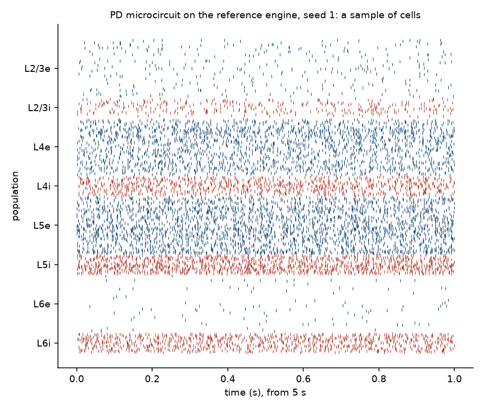
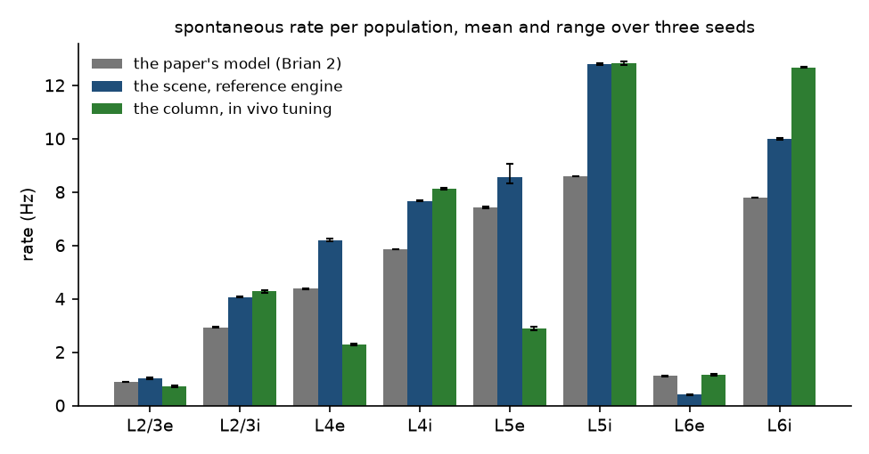

# Results: the Potjans and Diesmann 2014 microcircuit on linen

In two parts. The replication:
the cell type specific cortical microcircuit of Potjans and Diesmann (2014,
Cerebral Cortex 24:785) built at their scale from their published numbers
and run on linen's engines, its per-population rates, irregularity and
synchrony set beside the same measures from their model run on Brian 2 on
the same machine. The comparison: the Tab menu's mouse cortical column,
which carries their wiring on the measured rows of Izhikevich 2007 with its
background tuned to the in vivo rates of de Kock and Sakmann (2009), measured
the same way.

Runs of 2026-09-25 at commit 17271f5 (`runs/pd/overnight.sh`, the log and
every run folder under `runs/pd/`); the tables are `tools/pd_results.py` on
those folders. Each row is the mean over three seeds with the range.

## Methods

### The replication scene

`PD microcircuit` in `src/experiments.js`, opened by name (`?scenario=PD
microcircuit`, or `tools/linen.mjs run "PD microcircuit"`). Every setting is
on a node in the scene.

- Populations: the eight of the paper at its full-scale sizes (L2/3e 20,683,
  L2/3i 5,834, L4e 21,915, L4i 5,479, L5e 4,850, L5i 1,065, L6e 14,395,
  L6i 2,948; 77,169 cells), scattered uniformly in four layer boxes of 1 mm
  by 1 mm footprint at the column's depths.
- Connectivity: the paper's 8 by 8 connection probability matrix (verified
  against the reference implementation's `network_params.py`), applied by
  the connect node's pair table with a flat kernel
  over the column, so every pair's probability is the published one. Pairs
  are drawn independently by the pair hash (Bernoulli), where the paper
  draws a fixed total number of synapses per pair with multapses (its K
  formula, 298.9 million against the Bernoulli expectation of 284.8). Each
  run.json carries the commit.
- Synapses: current kicks of 43.9 pA ms per spike, the paper's 87.8 pA
  postsynaptic current with its 0.5 ms time constant integrated; inhibitory
  synapses at four times that (g = -4); the L4e to L2/3e weight doubled;
  weights lognormal with sigma 0.1 for the paper's Gaussian at ten percent.
- Delays: from distance at 400 um/ms, rounded to whole milliseconds, so the
  mean is near the paper's 1.5 ms for excitatory synapses; the paper's
  inhibitory delays are 0.8 ms with half that in spread, which a whole
  millisecond step cannot carry.
- Background: the paper's 8 Hz Poisson input over K_bg external synapses of
  the same strength per population (K_bg 1600, 1500, 2100, 1900, 2000,
  1900, 2900, 2100), carried per population as a constant current of rate
  times K_bg times the charge (562 to 1018 pA) and a per-millisecond noise
  term of the same variance (triangular, amplitude 372 to 518 pA).
- Cells: one custom row in two signs (cell type nodes on the `*e` and `*i`
  populations), the Izhikevich 2007 form matched to the paper's leaky
  integrate and fire neuron in capacitance (250 pF), rest (-65 mV),
  threshold (-50 mV), reset (-65 mV), refractory period (2 ms) and time
  constant at rest (10 ms; k = C / (tau (vt - vr)) = 1.667 nS/mV), with no
  recovery variable (b = 0, d = 0).
- Engine: 1 ms steps, no plasticity, seeds 1, 2 and 3 on the connect node
  (which seed the wiring, the noise and the initial state), 12 s of biology
  with the first 2 s dropped. The reference engine (`src/simworker.js`, in
  process) and the CUDA engine (`cuda/engine.cu`) each run every seed.

### Departures from the paper

Stated so the comparison is read correctly.

1. The membrane. The paper's neuron is leaky integrate and fire; this is
   the 2007 quadratic form with the same rest, threshold, reset,
   capacitance and time constant at rest. Its rheobase is 94 pA against the
   paper's 375, since the quadratic leak vanishes at threshold, so the same
   drive sits closer to firing here.
2. The step: 1 ms against the paper's 0.1 ms. What the step costs the
   column is measured in MODEL.md (what the one millisecond step costs).
3. Delays are whole milliseconds from distance; the paper's are Gaussian
   around 1.5 ms (excitatory) and 0.8 ms (inhibitory) with no distance.
4. Synapses are kicks; the paper's are exponential currents of 0.5 ms,
   which at a 1 ms step is one step.
5. Background is a constant current and per-millisecond noise of the
   Poisson input's mean and variance, not Poisson spikes through synapses.
6. Weights are lognormal at sigma 0.1; the paper's are Gaussian at ten
   percent with negative draws set to zero.
7. Pairs are Bernoulli at the published probability; the paper fixes the
   total number of synapses per population pair.

### The paper's model on Brian 2

`tools/pd2014_brian.py`: leaky integrate and fire with exponential currents
at 0.1 ms, every parameter from the paper's Table 5 and the reference
implementation, Poisson background over K_bg synapses, initial potentials at
-58 +- 10 mV as in the reference implementation, seeds 1, 2 and 3, 12 s with
the first 2 s dropped. Its numbers stand in for the paper's figure, since the
paper's text gives only the excitatory rates exactly (0.86, 4.45, 7.59 and
1.09 Hz for L2/3e, L4e, L5e and L6e; the coefficient of variation above 0.8
in every population; synchrony as the variance over mean of 3 ms counts).

### Measures

`tools/pd_measure.py` on each run folder: mean rate per population over the
window; the mean over cells with at least four spikes of the coefficient of
variation of interspike intervals; synchrony as the variance over the mean
of the population spike count in 3 ms bins, the paper's definition.
`tools/pd_results.py` assembles the tables as the mean over seeds with the
range across them.

### Reproducing every number

    node tools/linen.mjs run "PD microcircuit" --seconds 12 --seed 1 --engine cpu --cells all --out runs/pd/pd-cpu-s1
    node tools/linen.mjs run "PD microcircuit" --seconds 12 --seed 1 --engine cuda --cells all --out runs/pd/pd-cuda-s1
    node tools/linen.mjs run "mouse cortical column" --seconds 12 --seed 1 --engine cpu --cells all --over "stimulus:pulse on L4 E:current=0" --over "stimulus:pulse on L4 I:current=0" --out runs/pd/col-cpu-s1
    .venv-analysis/Scripts/python.exe tools/pd_measure.py runs/pd/pd-cpu-s1
    .venv-analysis/Scripts/python.exe tools/pd2014_brian.py --seconds 12 --seed 1 --out runs/pd/brian-s1.json
    .venv-analysis/Scripts/python.exe tools/pd_results.py runs/pd

`runs/pd/overnight.sh` runs all of it. The commit is recorded in each
`run.json`; the machine is an Intel Core Ultra 9 285K with an RTX 4080
SUPER, node 24.19, Brian 2 2.10.1.

## Results

Wall clock for 12 s of biology on the microcircuit's 284.8 million synapses:
45.6 s on the reference engine (0.26 times realtime), 29 s on the CUDA
engine (0.41), and about 915 s for the paper's model on Brian 2 at 0.1 ms.

### Potjans and Diesmann 2014, their model on Brian 2

Leaky integrate and fire at 0.1 ms, every parameter from the paper, the first 2 s dropped; 3 seeds: 1, 2, 3. 77,169 cells, 298,880,968 synapses.

| population | cells | rate Hz | ISI CV | synchrony |
|---|---|---|---|---|
| L2/3e | 20,683 | 0.89 (0.88 to 0.90) | 0.81 (0.80 to 0.81) | 59.30 (56.76 to 61.24) |
| L2/3i | 5,834 | 2.93 (2.92 to 2.94) | 0.86 (0.86 to 0.86) | 10.45 (10.32 to 10.55) |
| L4e | 21,915 | 4.38 (4.37 to 4.40) | 0.85 (0.85 to 0.85) | 67.29 (64.61 to 68.77) |
| L4i | 5,479 | 5.85 (5.85 to 5.86) | 0.84 (0.84 to 0.84) | 7.58 (7.37 to 7.70) |
| L5e | 4,850 | 7.42 (7.39 to 7.48) | 0.82 (0.81 to 0.82) | 26.26 (25.58 to 26.76) |
| L5i | 1,065 | 8.60 (8.59 to 8.61) | 0.78 (0.78 to 0.79) | 1.40 (1.39 to 1.41) |
| L6e | 14,395 | 1.11 (1.10 to 1.11) | 0.81 (0.81 to 0.82) | 8.92 (8.60 to 9.40) |
| L6i | 2,948 | 7.80 (7.80 to 7.81) | 0.79 (0.79 to 0.80) | 1.59 (1.58 to 1.59) |

### The microcircuit scene on the reference engine

The PD microcircuit scene at 1 ms, the first 2 s dropped; 3 seeds: 1, 2, 3. 77,169 cells, 284,780,202 synapses.

| population | cells | rate Hz | ISI CV | synchrony |
|---|---|---|---|---|
| L2/3e | 20,683 | 1.02 (0.99 to 1.05) | 0.81 (0.81 to 0.81) | 12.25 (11.81 to 12.91) |
| L2/3i | 5,834 | 4.07 (4.05 to 4.10) | 0.81 (0.81 to 0.81) | 2.77 (2.73 to 2.82) |
| L4e | 21,915 | 6.21 (6.17 to 6.27) | 0.79 (0.79 to 0.79) | 21.49 (21.21 to 21.65) |
| L4i | 5,479 | 7.67 (7.65 to 7.70) | 0.78 (0.77 to 0.78) | 3.57 (3.54 to 3.59) |
| L5e | 4,850 | 8.58 (8.32 to 9.06) | 0.74 (0.73 to 0.74) | 11.68 (11.64 to 11.71) |
| L5i | 1,065 | 12.80 (12.77 to 12.84) | 0.63 (0.63 to 0.64) | 1.18 (1.17 to 1.20) |
| L6e | 14,395 | 0.41 (0.40 to 0.43) | 0.78 (0.78 to 0.79) | 2.17 (2.11 to 2.22) |
| L6i | 2,948 | 9.99 (9.96 to 10.04) | 0.67 (0.67 to 0.68) | 0.88 (0.87 to 0.89) |

### The microcircuit scene on the CUDA engine

The PD microcircuit scene at 1 ms, the first 2 s dropped; 3 seeds: 1, 2, 3. 77,169 cells, 284,780,202 synapses.

| population | cells | rate Hz | ISI CV | synchrony |
|---|---|---|---|---|
| L2/3e | 20,683 | 1.03 (0.99 to 1.05) | 0.81 (0.81 to 0.81) | 12.44 (12.01 to 13.18) |
| L2/3i | 5,834 | 4.07 (4.05 to 4.10) | 0.81 (0.81 to 0.81) | 2.90 (2.73 to 3.02) |
| L4e | 21,915 | 6.21 (6.17 to 6.26) | 0.79 (0.78 to 0.79) | 21.61 (20.96 to 22.09) |
| L4i | 5,479 | 7.67 (7.65 to 7.70) | 0.78 (0.78 to 0.78) | 3.55 (3.38 to 3.65) |
| L5e | 4,850 | 8.58 (8.32 to 9.04) | 0.74 (0.73 to 0.74) | 12.05 (11.00 to 13.24) |
| L5i | 1,065 | 12.80 (12.77 to 12.84) | 0.64 (0.64 to 0.65) | 1.22 (1.14 to 1.28) |
| L6e | 14,395 | 0.41 (0.40 to 0.42) | 0.79 (0.78 to 0.79) | 2.20 (2.11 to 2.29) |
| L6i | 2,948 | 9.99 (9.97 to 10.04) | 0.67 (0.67 to 0.68) | 0.90 (0.84 to 0.93) |

### The mouse cortical column (in vivo tuning) on the reference engine

The Tab menu column with its thalamic pulse off, at 1 ms, the first 2 s dropped; 3 seeds: 1, 2, 3. 14,030 cells, 9,354,282 synapses.

| population | cells | rate Hz | ISI CV | synchrony |
|---|---|---|---|---|
| L2/3e | 3,750 | 0.72 (0.69 to 0.74) | 0.81 (0.80 to 0.81) | 1.28 (1.27 to 1.29) |
| L2/3i | 1,060 | 4.29 (4.24 to 4.34) | 1.07 (1.06 to 1.07) | 1.54 (1.51 to 1.59) |
| L4e | 4,000 | 2.30 (2.27 to 2.32) | 0.81 (0.80 to 0.81) | 1.29 (1.25 to 1.33) |
| L4i | 990 | 8.12 (8.09 to 8.16) | 1.09 (1.09 to 1.09) | 1.87 (1.84 to 1.90) |
| L5e | 880 | 2.90 (2.83 to 2.97) | 0.55 (0.54 to 0.55) | 1.28 (1.26 to 1.29) |
| L5i | 200 | 12.84 (12.76 to 12.92) | 0.99 (0.99 to 1.00) | 1.07 (1.03 to 1.10) |
| L6e | 2,620 | 1.17 (1.11 to 1.20) | 0.81 (0.80 to 0.83) | 1.19 (1.18 to 1.20) |
| L6i | 530 | 12.68 (12.65 to 12.71) | 1.03 (1.03 to 1.03) | 1.19 (1.17 to 1.21) |

### The mouse cortical column (in vivo tuning) on the CUDA engine

The Tab menu column with its thalamic pulse off, at 1 ms, the first 2 s dropped; 3 seeds: 1, 2, 3. 14,030 cells, 9,354,282 synapses.

| population | cells | rate Hz | ISI CV | synchrony |
|---|---|---|---|---|
| L2/3e | 3,750 | 0.73 (0.69 to 0.75) | 0.81 (0.80 to 0.81) | 1.27 (1.23 to 1.35) |
| L2/3i | 1,060 | 4.29 (4.25 to 4.33) | 1.07 (1.06 to 1.07) | 1.51 (1.48 to 1.53) |
| L4e | 4,000 | 2.30 (2.28 to 2.32) | 0.80 (0.80 to 0.81) | 1.25 (1.21 to 1.29) |
| L4i | 990 | 8.13 (8.10 to 8.17) | 1.09 (1.08 to 1.10) | 1.87 (1.77 to 2.02) |
| L5e | 880 | 2.92 (2.83 to 3.00) | 0.55 (0.55 to 0.55) | 1.29 (1.26 to 1.33) |
| L5i | 200 | 12.83 (12.74 to 12.96) | 0.99 (0.98 to 1.00) | 1.05 (1.01 to 1.08) |
| L6e | 2,620 | 1.17 (1.11 to 1.21) | 0.81 (0.81 to 0.81) | 1.19 (1.16 to 1.23) |
| L6i | 530 | 12.69 (12.66 to 12.71) | 1.03 (1.03 to 1.04) | 1.16 (1.14 to 1.17) |

### Four more measurements

Made the same night, after the tables, to read them (`runs/pd/variants.sh`
and `tools/pd2014_brian.py --dt 1.0`; the tables are in `runs/pd/tables.md`).

- Stationarity. The scene for 60 s on the CUDA engine, seed 1: every
  population is within two percent of its value in the 12 s runs from 3 s
  to 60 s (L2/3e 0.97 to 1.01 Hz, L4e 6.24 to 6.30, L5e 8.76 to 9.24, L6e
  0.40 to 0.44, the interneurons likewise). The 12 s runs are of the
  stationary state.
- The other membrane matching. The scene with both rows at k 6.667 nS/mV,
  which matches the paper's rheobase (375 pA) instead of its time constant
  and leaves a 2.5 ms time constant at rest, on the CUDA engine, three
  seeds: a synchronized runaway at 17 to 85 Hz in every population, with a
  3 ms synchrony in the thousands. On the quadratic form the time constant
  is the matching that keeps the paper's regime; the rheobase matching does
  not.
- The paper's model at the scene's step. The same Brian 2 transcription
  with dt 1 ms (delays clipped to one step, so the inhibitory delays of 0.8
  ms become 1 ms), seed 1: a synchronized runaway at 13 to 46 Hz with a 3
  ms synchrony of 660 to 16,574, and an hour of wall clock for the twelve
  seconds. The paper's model does not tolerate a one millisecond step. One
  seed is reported because the outcome is not a matter of degree.
- The largest step the paper's model tolerates. The same transcription at
  0.5 and 0.25 ms, seed 1, against its 0.1 ms values: at 0.25 ms the rates
  are 1.01, 3.10, 4.36, 5.91, 7.71, 8.71, 1.08 and 7.89 Hz (within 13
  percent of 0.1 ms in every population, the interval variability within
  0.02) with the 3 ms synchrony about twice that at 0.1 ms; at 0.5 ms the
  rates are 2.58, 5.73, 4.03, 7.22, 9.74, 9.86, 1.02 and 9.70 (L2/3e
  nearly three times its 0.1 ms value) with the synchrony 4.5 to 213 times
  higher by population (L4e 4.5, L2/3e 80, L6i 213), a partly synchronized
  state on the way to the runaway at 1 ms.
  So the paper's model needs a step of 0.25 ms or below: a substep of four
  on a 1 ms engine, not two.

### Figures

`tools/pd_figures.py runs/pd figures/pd` draws both from the run folders.

## Reading

The two engines agree. On the microcircuit every population's rate differs
by under one percent between the reference engine and CUDA, the interval
variability by a hundredth, and the synchrony by a few percent, with the
same across the three seeds; the same holds on the column. What follows is
therefore about the model, not the engines.

The replication reproduces the shape of the paper's result and not its
numbers. The paper's model, run here, gives its published excitatory rates
(0.89, 4.38, 7.42 and 1.11 Hz for L2/3e, L4e, L5e and L6e against the
paper's text 0.86, 4.45, 7.59 and 1.09), so the transcription is faithful
and the reference column of the table can be trusted. The scene gives 1.02,
6.21, 8.58 and 0.41: layer 5 highest, layer 4 next, the superficial and
deep layers near or below one hertz, every inhibitory population above its
excitatory partner, interval variability irregular (0.63 to 0.81 against
the paper's 0.78 to 0.86), and the activity asynchronous in the
inhibitory populations and more synchronous in the excitatory ones, as in
the paper's model though less so (3 ms variance over mean of 12 to 21 in
L2/3e, L4e and L5e against the paper's model's 26 to 67; the paper reports
low-amplitude fast oscillations). The differences in rate are 15 to 50
percent upward in seven populations and a factor of 2.7 downward in L6e,
which is the one population whose order the scene gets wrong: the paper has
L6e above L2/3e and the scene has it below.

Every departure in the methods is a candidate for those differences, and
the four measurements above say which ones are not. It is not the
membrane's rheobase in the way the first reading supposed: matching it
instead of the time constant does not move the scene toward the paper's
numbers, it destroys the regime. And it is not something the paper's model
would survive at this step: run at 1 ms with everything else theirs, the
paper's model falls into a synchronized runaway, so a leaky integrate and
fire row on these engines would not replicate the paper either. What the
scene shows is a circuit that holds the paper's regime at a step the
paper's model cannot take, with a membrane that fires more easily (the
quadratic row's rheobase is 94 pA against 375) and delays from distance in
whole milliseconds where the paper's inhibition arrives at 0.8 ms. The
direction of seven of the eight rate differences is the easier firing.
Layer 6 has the most external synapses (K_bg 2900) and, onto its
excitatory cells, the highest ratio of local inhibitory to local
excitatory connection probability (L6i at 0.2252 against L6e at 0.0396,
5.7 to 1, against 4.5 in layer 5 and under 3 in layers 2/3 and 4). That it
turns the surplus into inhibition, putting L6e alone below the paper's
model and below L2/3e, is a reading no run has tested yet (one with L6i
onto L6e scaled down would). Separating the step from the
membrane on this model needs a step below a millisecond, which is
an open decision; with it, a leaky integrate and fire
row becomes the test of the rest.

The comparison is a different claim and holds cleanly. The Tab menu column
carries the paper's wiring on the measured rows of Izhikevich 2007 with its
background tuned to the in vivo rates of de Kock and Sakmann (2009), and it
reads 0.73, 2.30, 2.92 and 1.17 Hz for the four excitatory populations,
inside those bands, in the paper's order (layer 5, layer 4, layer 6, layer
2/3), with every inhibitory population above its excitatory partner (4.3,
8.1, 12.8 and 12.7 Hz), interval variability of 0.8 to 1.1 (0.55 in layer
5, whose pyramids are bursting cells) and a 3 ms synchrony of 1.0 to 1.9,
which is asynchronous. It is what the wiring does on a membrane with a
capacitance and a rest, driven to the rates the tissue shows in vivo rather
than to the paper's operating point, and the paper's in vivo comparison
(its Table 6: L2/3e under 1 Hz, L5e the highest) reads the same way.

What this result is, stated plainly: the paper's connectivity, strengths
and background, built from the published numbers at the published scale
and run on two engines that agree, give the paper's ordering and regime at
a step the paper's own model does not survive, with rates 15 to 50 percent
above its in seven populations and one population below; the paper's own
model gives its own numbers on this machine at its own step; and the in
vivo tuning of the same wiring lands in the recorded bands. What it is
not: a replication of the paper's rates, which needs a step below a
millisecond before the membrane can be tested.
